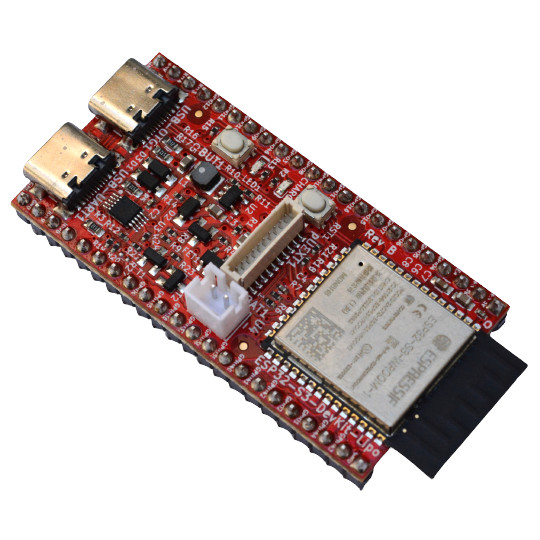
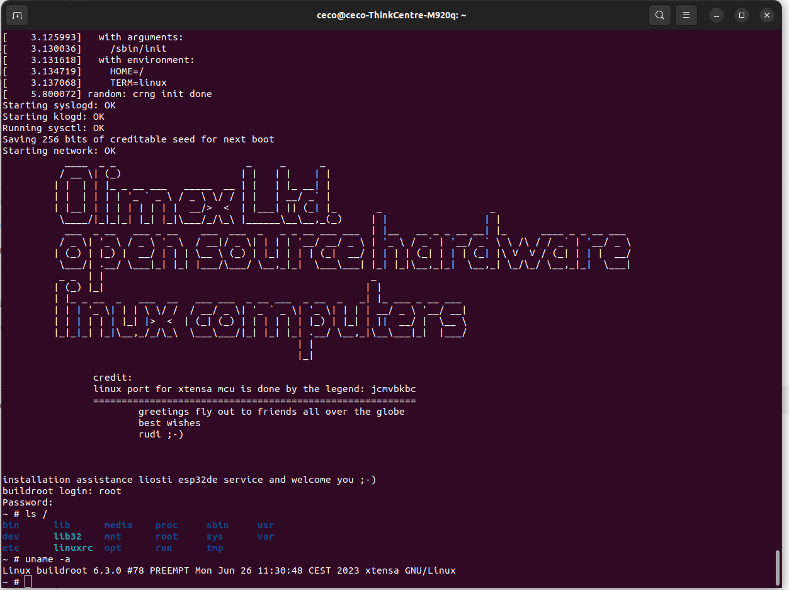

# ESP32-S3-DevKit-LiPo
ESP32-S3 development board with JTAG/USB-OTG and LiPo charger

ESP32-S3-DevKit-LiPo is small board capable to run Linux kernel 6.3

## Features

* ESP32-S3-WROOM-1-N8R8 8MB RAM 8 MB Flash
* Green Status LED
* Yellow Charge LED
* pUEXT connector
* USB-C power supply and USB-Serial programmer
* USB-C OTG JTAG/Serial connector
* LiPo charger
* LiPo battery connector
* External power sense
* Battery measurement
* Automatic power supply switch between USB and LiPo
* RESET button
* USER button

## Licenses

* Hardware is released under CERN Open Hardware Licence Version 2 - Strongly Reciprocal, all silkscreen credits to Olimex should remain;
* Software is released under GPL3 Licensee
* Documentation is released under CC BY-SA 3.0